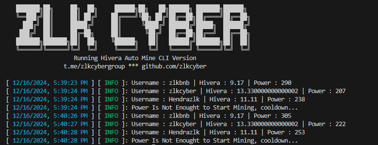
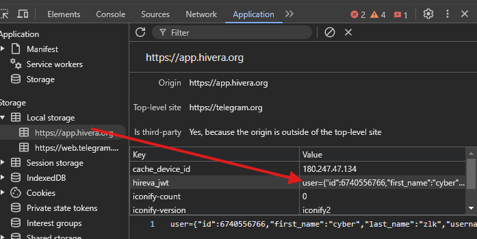

# HIVERA TELEGRAM MINIAPP BOT
一个去中心化的网络， powered by @ton_blockchain，得到 @Ton_Incubator 的支持。助力全球AI创新。[https://t.me/Hiverabot](https://t.me/Hiverabot/app?startapp=2b6a4dfc8)



## 功能

- **自动挖掘 Hivera 代币**
- **支持多账户**
- **支持代理**：在 `proxies.txt` 中填写代理，格式为 `http://user:pass@ip:port`

## 必要条件

- **Node.js**：确保你的机器上已安装 Node.js。
- **npm**：确保你的机器上已安装 npm。
- **Hivera Jwt**：按以下步骤获取
- **打开 MiniApp HiveraBot**：[https://t.me/Hiverabot](https://t.me/Hiverabot/app?startapp=2b6a4dfc8)
- 使用开发者工具（按 F12 或右键选择“检查”），在 Local Storage 中找到 `Hivera_jwt` 并复制它。
    

## 安装步骤

1. 克隆代码仓库：
   ```bash
   git clone https://github.com/Zlkcyber/hiveraBot.git
   cd hiveraBot
   ```

2. 安装依赖：
   ```bash
   npm install
   ```

3. 设置：将 Hivera jwt 粘贴到 `users.txt` 文件中，每行一个账户：
   ```bash
   nano users.txt
   ```

4. 运行脚本：
   ```bash
   npm run start
   ```
